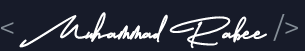

## 
  

  

Hey my name's Muhammad! I'm currently pursuing a bachelor's degree in Data Science from the [University of Waterloo](https://uwaterloo.ca/data-science/). I love using tech to find creative solutions to problms, In particular I am extremley passionate about full-stack devlopment, and machine learning. Feel free to reach out and connect with me throught the following channels:

<h3 align="left">⚡ Languages and Tools:</h3>

                 

<!---
rabee-m/rabee-m is a ✨ special ✨ repository because its `README.md` (this file) appears on your GitHub profile.
You can click the Preview link to take a look at your changes.
--->
